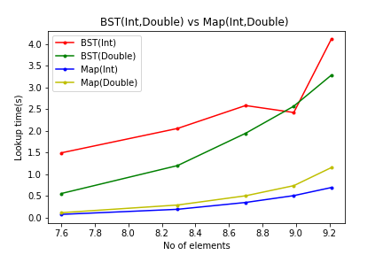

# Report

## Structure

* ***Node*** - It is a structure for the node of the BST
* ***BST*** - It is a class to represent the structure and functions of the BST
* ***Iterator*** - It is a class to represent the structure and functions of the Iterator for the BST
* ***ConstIterator*** - It is a class to represent the structure and functions of the Const Iterator for the BST

## Functions

* ***insertNode*** - a function to insert a node into the BST
* ***balanceTree*** -  a function to balance the BST
* ***findNode*** -  a function to find a node in the BST
* ***height*** - a function to find the height of the BST
* ***clearTree*** - a function to delete the BST
* ***[]*** - an operator to find the value of the given key in the BST
* ***<<*** - an operator to print the contents of the BST

## Tests

Execute ***main.o*** to test the above mentioned functions

## Performance

Execute ***performance.o*** to benchmark and compare the performance of Unbalanced BST, Balanced BST, Map and Unordered Map.

* ***Unbalanced BST vs Map***

Comparison of lookup time for **Unbalanced BST and Map** for data types **Int and Double**

* ***BST vs Map (Int)***

Comparison of lookup time for **Unbalanced BST, Balanced BST, Map and Unordered Map** for data type **Int**

vsMap.png)

* ***BST vs Map (Double)***

Comparison of lookup time for **Unbalanced BST, Balanced BST, Map and Unordered Map** for data type **Double**

vsMap.png)

From the given **comparison graphs**, we can conclude that the performance are in the following order (from highest to lowest)

  - Unordered Map
  - Map
  - Balanced BST
  - Unbalanced BST

  But, this doesn't mean that we should opt for map at all times. We should choose either BST or map based on the situation in which we are using it.

  For instance

  - If we need our collection to be ordered at all times then binary tree is a better option
  - If we use unordered collection, then map is a better option as it takes less time for lookup

  Thus, we gained knowledge about the implementation of the Binary Search Tree using various features of C++ and also about the look up performance comparison of Binary Search Tree and a map. Hence, we would be able to choose the best data structure as per our need.
